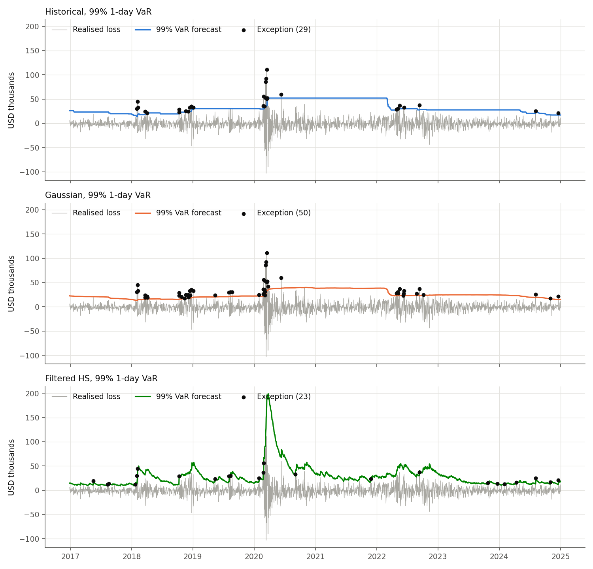
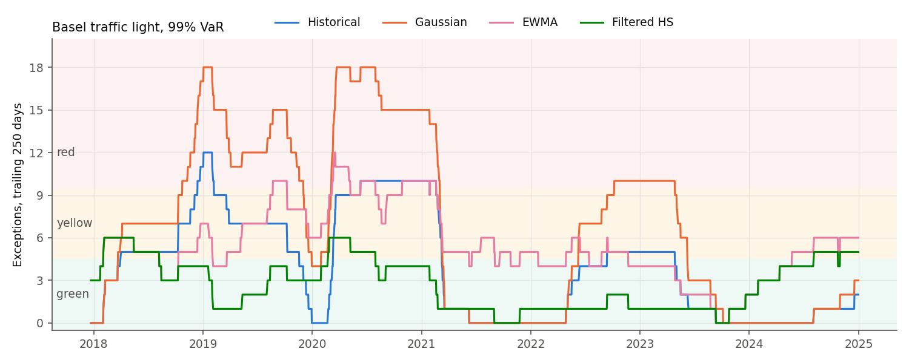
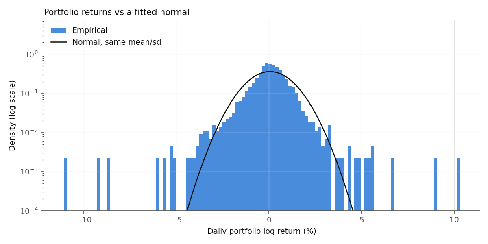

# var-backtesting

[](https://github.com/Pranathi-Vallamreddy/var-backtesting/actions/workflows/tests.yml)

1-day Value-at-Risk and Expected Shortfall for a six-stock equity portfolio,
with a rolling out-of-sample backtest and stressed VaR. Methods: historical
simulation, variance-covariance (Gaussian and Student-t), Monte Carlo, EWMA
(RiskMetrics) and filtered historical simulation.

The portfolio is $1m equally weighted in AAPL, MSFT, JPM, XOM, JNJ and PG
(tech, banks, energy, healthcare, staples), 2015-2024. Everything is set in
`config/portfolio.yaml`. Formulas and references are in
[docs/methodology.md](docs/methodology.md).

## Install

```
pip install -e ".[test]"
pytest
```

Prices come from Yahoo Finance via `yfinance` and are cached in `data/`.

## Usage

```
python -m varlib.cli --config config/portfolio.yaml var        # current VaR/ES, all methods
python -m varlib.cli --config config/portfolio.yaml backtest   # coverage tests, figures to results/
python -m varlib.cli --config config/portfolio.yaml stress     # stressed vs current VaR
```

The backtest re-estimates every model on each of ~2,000 days and takes about a
minute.

## Results

Rolling 500-day estimation window, forecasts from 2016-12-28 to 2024-12-31
(2,015 days). Expected exceptions: 100.8 at 95%, 20.2 at 99%. Tests at 5%.

| 99% VaR | Exceptions | Kupiec p | Christoffersen p | Cond. coverage p | Loss / ES on exception days | Basel, last 250d | Basel, worst 250d |
|---|---|---|---|---|---|---|---|
| Filtered HS | 23 | 0.53 | 0.26 | 0.44 | 25.0k / 25.5k | yellow (5) | yellow (6) |
| Historical | 29 | 0.063 | 0.007 | 0.005 | 41.3k / 39.6k | green (2) | red (12) |
| EWMA | 43 | <0.001 | 0.32 | <0.001 | 31.2k / 26.5k | yellow (6) | red (12) |
| Student-t (nu=5) | 45 | <0.001 | <0.001 | <0.001 | 36.0k / 31.7k | green (2) | red (17) |
| Gaussian | 50 | <0.001 | <0.001 | <0.001 | 34.5k / 24.3k | green (3) | red (18) |
| Monte Carlo | 50 | <0.001 | <0.001 | <0.001 | 34.5k / 24.1k | green (3) | red (18) |

At 95% every method passes Kupiec, but only EWMA (106 exceptions, conditional
coverage p = 0.85) and filtered HS (112, p = 0.41) pass independence; the four
equal-weighted methods all have p < 0.001.

The four methods that weight the window equally fail for two separate
reasons, and the two volatility-updating methods isolate them:

- **Volatility clustering.** A 500-day equally weighted window reacts too
  slowly when volatility jumps, so exceptions arrive in runs and every
  equal-weighted method fails Christoffersen. EWMA fixes this (independence
  p = 0.32) but keeps the Gaussian tail and has twice the expected exceptions
  at 99%.
- **Fat tails.** The Gaussian model has 2.5 times the expected 99% exceptions,
  and on those days the average loss is $34.5k against a forecast ES of
  $24.3k. Monte Carlo matches it, as it should, since it samples the same
  fitted normal. Historical simulation gets the tail shape right (loss $41.3k
  vs ES $39.6k) but not the timing.

Filtered historical simulation combines the two, empirical tail scaled to
EWMA volatility, and is the only method that passes all three tests at both
confidence levels. Its ES also matches realised tail losses. The cost is
stability: its 99% VaR went from about $20k to $200k within a month in March
2020, so any capital tied to it would swing the same way. It is also in the
yellow zone over the last 250 days, because 2024 was calm enough that EWMA
volatility fell low and moderate losses breached it.



Equal-weighted exceptions cluster in four episodes: February-April 2018,
October-December 2018, February-March 2020 (10 of the Gaussian model's 50 in
March 2020 alone), and April-October 2022. Historical VaR also shows the
window's ghosting effect: it steps up when March 2020 enters the sample and
stays there until those days roll out two years later.



The equal-weighted methods are all green over the last 250 days but each
spent long stretches in the red, so the last-250-day reading on its own
overstates how well they work.



Stressed VaR, calibrated to Sep 2008 - Mar 2009 (145 days), against the most
recent 500 days:

| 99% | Current VaR | Stressed VaR | Ratio |
|---|---|---|---|
| Historical | 17,097 | 81,960 | 4.8 |
| Gaussian | 14,814 | 84,284 | 5.7 |
| Student-t | 16,678 | 94,156 | 5.6 |
| Monte Carlo | 14,704 | 83,993 | 5.7 |

The ratios are high partly because 2023-24 was calm. With 145 observations
the 99% historical figure rests on one or two days. EWMA and FHS are not
shown, since they condition on end-of-window volatility rather than the
period as a whole.

## Assumptions

- Within the window, standardised returns are i.i.d. For the four
  equal-weighted methods the raw returns are, which is the assumption the
  backtest rejects.
- Constant notional and fixed weights, rebalanced daily. Portfolio return is
  the weighted sum of log returns, a first-order approximation.
- Adjusted closes, so dividends are treated as reinvested.
- 1-day horizon only; no square-root-of-time scaling.
- Gaussian, Student-t and Monte Carlo use the sample mean; EWMA and FHS use
  zero, as in RiskMetrics.

## Limitations

- EWMA uses the RiskMetrics lambda = 0.94 rather than an estimated one, and
  there is no GARCH model to compare against.
- Equity only, linear positions. No options, so no gamma or vega, and
  delta-normal is exact here only because the book is linear.
- Monte Carlo draws are multivariate normal, so here it adds nothing beyond
  the Gaussian model; it would matter with non-linear positions.
- The Student-t uses a fixed nu = 5. An MLE fit on the full sample gives about
  2.8, close to where the variance is undefined, so the fixed value is a
  pragmatic choice rather than an estimate.
- The ES check is a comparison of averages, not a formal ES backtest.
- No liquidity horizon, transaction costs, FX, or intraday risk.
- Stress windows are short (145 days for the GFC, about 50 for COVID), so
  stressed historical VaR is indicative only.
- Six names on one data source. Yahoo adjusted prices are fine for this but
  are not a vetted market data feed.

## References

See [docs/methodology.md](docs/methodology.md).
